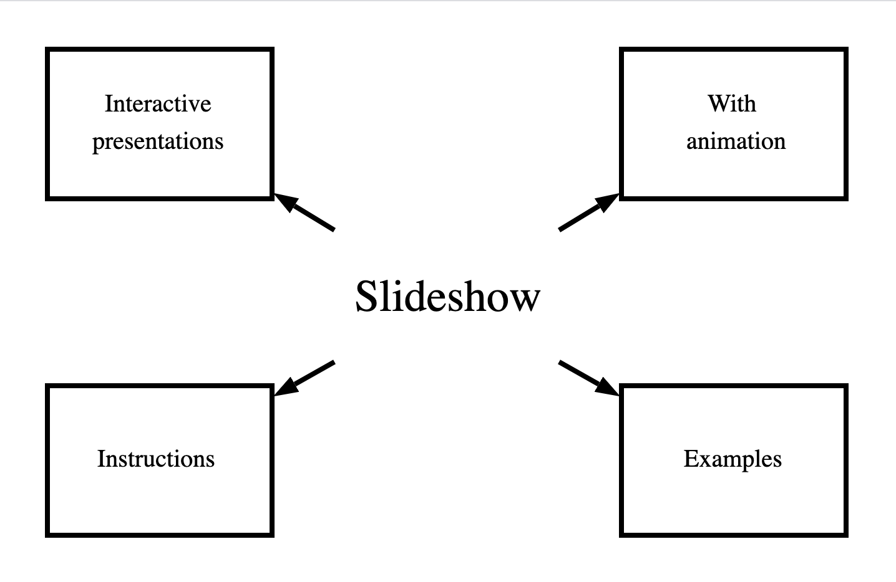

# Slideshow

Build interactive presentations using animation to increase impact.

<p  align="center">
    
</p>

## Instructions

### Step 1
Use Block Diagram Editor to create a drawing.

### Step 2
Import drawing file into Slideshow. Copy an existing draw file as a starting point. Coming soon: copy Block Diagram Editor diagram to the clipboard in a draw format. For now, from Chrome right click in the Block Diagram Editor and select "Inspect". Use this to determine the coordinates to use for diagram shapes.

### Step 3
Add text and transitions

### Step 4
Build and run slideshow to play. Open app at http://localhost:8080.

## Build & Run

### build
```
go build
```

### run
```
./slideshow [-input <path>]
```

### docker build
```
docker build --tag slideshow-image .
docker run --name slideshow -p 8080:8080 -d slideshow-image

docker stop slideshow
docker rm slideshow
docker rmi slideshow-image
```
